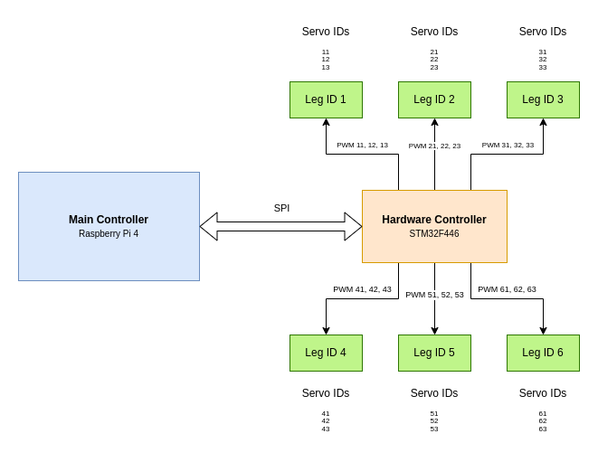

# Hexapod Hardware Controller
Hexapod Hardware Controller project contains code essential for controlling hardware components of Hexapod Robotic System.
# Hexapod System Hardware Diagram

# Servo PWM Control
## Timers
The goal of controlling all 6 legs of Hexapod, each containing 3 individually addressable servo motors requires the usage of 8 timers available on STM32F446 microcontroller. Generally, it would be possible to use only 6 timers, but due to the fact that current setup uses the mircocontroller in LQFP64 package, the number of pins and connected to them peripherals is limited.

Each timer is set to tick every 1us, so provided that MCU is working at 180MHz the values of ARR(Auto Reload Register) and PSC (Prescaler Register) are:

- PSC: 179
- ARR: 19999

## Servo motor type and its parameters
Servo motor MG996R from Tower Pro was chosen to drive all joints. Here are its most important parameters and corresponding values from the producer (but some values are the result of empiric measurements):

- Movement range:
  - Min angle: 0 deg
  - Max angle: 180 deg
- PWM signal period: 20 ms
- PWM High Time for angle set to 0 deg: 544us (2.72% Duty Cycle)
- PWM High Time for angle set to 180 deg: 2550us (12.75% Duty Cycle)

## Control functions
```c
// Starts PWM for a servo channel using the specified timer
void startPWMServo(TIM_HandleTypeDef* tim, uint8_t channel);

//Disables PWM for a servo channel using the specified timer
void disablePWMServo(TIM_HandleTypeDef* tim, uint8_t channel);

// Sets the PWM pulse value for a servo channel using the specified timer
void setPWMPulseValue(TIM_HandleTypeDef* tim, uint8_t channel, uint16_t pulse_value);

//Sets the servo angle for a servo channel using the specified timer
void setServoAngle(TIM_HandleTypeDef* tim, uint8_t channel, float angle);

// Calculates the CCR (Capture/Compare Register) value for a given angle
uint16_t calculateCCRValue(float min_angle, float max_angle, float angle, float min_ms, float max_ms);
```

# Hexapod SPI Communication Protocol v1.0.0
## SPI Configuration
- SPI working in Master transmit - Slave receive mode
- NCS: Chip Select signal working in active LOW mode, idle HIGH
- Frames type: Motorola
- Number of data bits in one frame: 8 bit
- First bit: MSB first
- No CRC generation

Clock parameters:
- Hardware controller max baudrate: 20.0 MBits/s 
- Master transmission baudrate: 2.5 MBits/s
- Clock polarity: LOW
- Clock phase: 1 Edge

Hardware controller SPI connections:

| Connection name | STM32F446 Port & Pin number |
|-----------------|-----------------------------|
| MOSI            | PC1                         |
| MISO            | PC2                         |
| SCK             | PB13                        |
| NCS             | PD2                         |


## Frame Types
Currently, Hexapod SPI Communication Protocol version 1.0 supports 2 types of data frames:

| Frame Type     | Frame Type ID | Description                                                |
| -------------- | ------------- | ---------------------------------------------------------- |
| ONE LEG Frame  | 1             | Contains data for all 3 servos located in one leg           |
| ONE SERVO Frame| 2             | Contains data only for one specific servo                   |


### ONE LEG Frame

| 1 Byte      | 2 Byte      | 3 Byte      | 4 Byte        | 5 Byte      | 6 Byte        | ... | 11 Byte     | 12 Byte      | 13 Byte      | 14 Byte       |
|-------------|-------------|-------------|---------------|-------------|---------------|-----|-------------|--------------|--------------|---------------|
| FRAME LEN   | FRAME TYPE  | SERVO ID 1  | SERVO OP TYPE | INT PART 1  | FLOAT PART 1  | ... | SERVO ID 3  | SEVO OP TYPE | INT PART 3  | FLOAT PART 3  |

- FRAME LEN - FRAME's length in bytes - for ONE LEG frame set to 14
- FRAME TYPE - 1 Byte - for ONE LEG frame set to 1

After the first two bytes there is a sequence repeated 3 times which contains control data for each servo
- SERVO ID - Number compatible with numeration specified on Hexapod System Hardware Diagram. The tens is a digit coresponding with leg number and ones is a digit coresponding with the servo number in the kinematic chain starting from the robot's main body up to the FCP.

- SERVO OP TYPE - Servo operation number 
  - START & SET - value 1
  - STOP - value 2
  - SET - value 3
- INT PART - integer part of desired angle - integer value ranging from 0 to 180
- FLOAT PART - float part of the desired angle - integer value randing from 0 to 99

### ONE SERVO Frame
| 1 Byte      | 2 Byte      | 3 Byte      | 4 Byte        | 5 Byte      | 6 Byte        |
|-------------|-------------|-------------|---------------|-------------|---------------|
| FRAME LEN   | FRAME TYPE  | SERVO ID    | SERVO OP TYPE | INT PART    | FLOAT PART     |

- FRAME LEN - FRAME's length in bytes - for ONE SERVO frame set to 6
- FRAME TYPE - 1 Byte - for ONE SERVO frame set to 2
- SERVO ID - Number compatible with numeration specified on Hexapod System Hardware Diagram
- SERVO OP TYPE - Servo operation number
  - START & SET - value 1
  - STOP - value 2
  - SET - value 3
- INT PART - integer part of desired angle - integer value ranging from 0 to 180
- FLOAT PART - float part of the desired angle - integer value randing from 0 to 99
### Functions
```c
// Sends a Hexapod SPI message in pooling mode
void sendSPIBlocking(SPI_HandleTypeDef* hspi, RAW_SPI_Message* message);

// Receives a Hexapod SPI message in pooling mode
void receiveSPIBlocking(SPI_HandleTypeDef* hspi, RAW_SPI_Message* message);

//Interprets the content of a Hexapod SPI message based on its type
void interpretMessage(RAW_SPI_Message* message);

// Interprets the content of a byte array representing data for one servo motor
void interpretOneServoData(const uint8_t* data);
```

